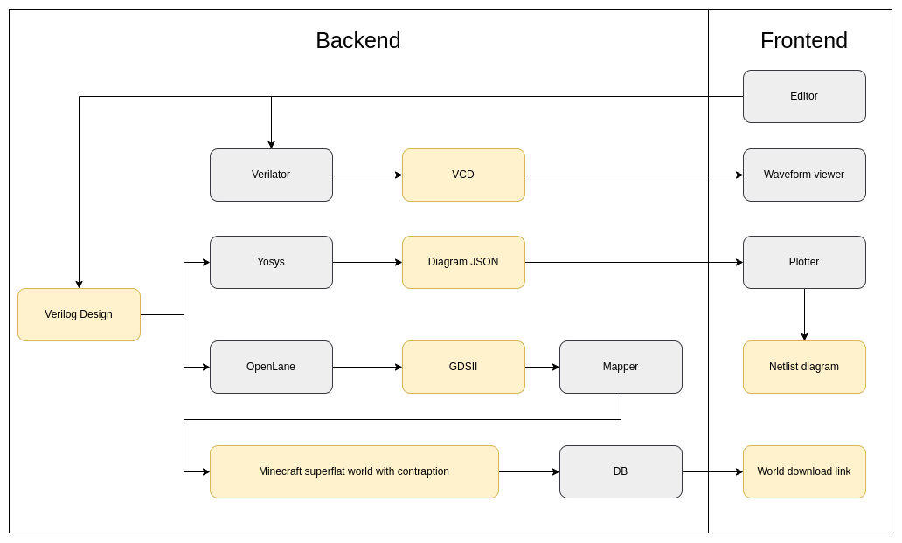

# Redstone HDL
### Verilog synthesizer for Minecraft Redstone circuits

## Useful links
* Minecraft redstone
  - https://minecraft.fandom.com/wiki/Redstone_circuits/Logic
  - https://minecraft.fandom.com/wiki/Command_Block
  - https://minecraft.fandom.com/wiki/Structure_Block
  - https://www.curseforge.com/minecraft/mc-mods/super-circuit-maker

* Verilog
  - https://personal.utdallas.edu/~xxx110230/verilog/
  - https://www.edaplayground.com/
  - http://www.asic-world.com/verilog/veritut.html
  - https://www.fpga4fun.com/
  - https://www.chipverify.com/

## Future development
- Add drag and drop coding features using [visual verilog](https://github.com/MarwanYoussef/Visual-Verilog) 
- Add custom symbols for each verilog module on website using [symbolator](https://github.com/kevinpt/symbolator)

## Similar projects
- https://github.com/itsFrank/MinecraftHDL
- https://github.com/cemulate/minecraft-hdl
- https://github.com/tech4me/HDL2Redstone

### Made with lots of ⏱️, 📚 and ☕ by InputBlackBoxOutput
